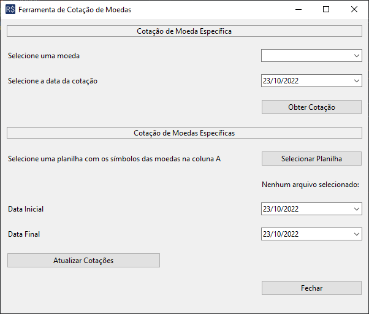

# Sistema de Busca de Cotações de Moedas

## Contexto

Este projeto apresenta um sistema construído com o tkinter, uma
biblioteca padrão do Python, para obtenção de cotações de
moedas estrangeiras usando a API do <abbr title="Banco Central do Brasil">BACEN</abbr>.

A janela permite que o usuário execute duas tarefas: (1) obter
a cotação de uma das moedas disponíveis em uma data especificada e
(2) obter uma planilha com as cotações de uma lista de moedas num
período especificado.

Ao término da execução da tarefa de obter a cotação para uma única moeda,
o sistema exibe uma mensagem na tela com o valor da cotação.

Caso o usuário tenha optado por obter as cotações de uma lista de moedas,
o sistema cria uma planilha com as cotações do perído especificado no mesmo diretório
do programa.

## Pontos de Acesso da API Usada

Estes são os links dos pontos de acesso da API que utilizei:

- [Ponto de Acesso da API de Moedas](https://olinda.bcb.gov.br/olinda/servico/PTAX/versao/v1/aplicacao#!/recursos/Moedas#eyJmb3JtdWxhcmlvIjp7IiRmb3JtYXQiOiJqc29uIiwiJHRvcCI6MTAwfX0=)
- [Ponto de Acesso da API para Cotação por Data](https://olinda.bcb.gov.br/olinda/servico/PTAX/versao/v1/aplicacao#!/recursos/CotacaoMoedaDia#eyJmb3JtdWxhcmlvIjp7IiRmb3JtYXQiOiJqc29uIiwiJHRvcCI6MTAwfX0=)
- [Ponto de Acesso da API para Cotação por Período](https://olinda.bcb.gov.br/olinda/servico/PTAX/versao/v1/aplicacao#!/recursos/CotacaoMoedaPeriodo#eyJmb3JtdWxhcmlvIjp7IiRmb3JtYXQiOiJqc29uIiwiJHRvcCI6MTAwfX0=)

## Bibliotecas Utilizadas

Neste projeto, utilizei as seguintes bibliotecas:

- tkinter
- tkcalendar
- requests
- numpy
- pandas

## Captura de Tela da Janela do Sistema

Eis uma captura de tela da janela do sistema:

